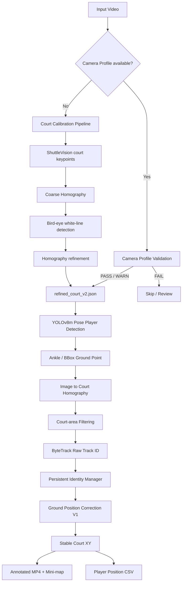

# Badminton Tracker

離線羽球電腦視覺分析專案。目前核心目標是從固定攝影機影片中，自動取得球場座標、追蹤場上球員，並維持穩定的邏輯身份（P1–P4），最後輸出帶有球員標記與 mini-map 的影片，以及可供後續分析使用的球場座標 CSV。

目前專案已完成一個可用的 **Court + Player Tracking milestone**，並包含單打、雙打測試影片、輸出結果與 regression results，方便後續同學直接查看成果並繼續開發。

---

## 目前完成狀態

- Court Calibration V1
- 固定攝影機 Camera Calibration Profile V1
- Player Detection / Pose Estimation
- ByteTrack raw tracking
- Persistent Logical Player Identity V2.2
- Singles / Doubles roster constraint
- 遮擋後 reacquire
- Raw-ID ownership protection
- Ground Position Correction V1
- Mini-map visualization
- Player position CSV output
- Singles regression（`Videos/1p/1.mp4` ~ `9.mp4`）
- Doubles regression（`Videos/2p/1.mp4` ~ `13.mp4`）

尚未完成：Shuttlecock tracking、完整電視轉播的 replay / 廣告 / 換鏡頭 segment gate，以及更進階的 Ground Position Correction。

---

## 系統架構



白話版：

```text
影片
  ↓
找球場 / 驗證攝影機 calibration
  ↓
把畫面座標轉成真實羽球場座標
  ↓
YOLO Pose 找人
  ↓
ByteTrack 提供短期 raw track ID
  ↓
Identity Manager 維持 P1/P2/P3/P4
  ↓
Ground Position Correction 過濾不合理單幀跳點
  ↓
輸出標記影片 + mini-map + CSV
```

---

## 使用技術

### Python / Computer Vision

- Python
- OpenCV
- NumPy
- Ultralytics YOLO
- ByteTrack（透過 Ultralytics `tracker="bytetrack.yaml"`）

### Court Detection

Court 初始偵測使用 ShuttleVision 相關的 court pose model（`best.pt`）。目前 Court model 以 **22 個球場 keypoints** 對應標準羽球場座標。

重要：Court model 訓練時使用 **stretch 到 640 × 640** 的影像，因此 inference 也必須先直接 resize 成 640 × 640，不能改成一般 letterbox preprocessing，否則 keypoint 幾何位置會改變。

### Player Detection

球員使用：

```text
yolov8m-pose.pt
```

目前程式會在 `third_party/` 下自動搜尋該權重。

Ground point 優先順序：

1. 左右腳踝都可信 → 兩腳踝中點
2. 只有一側腳踝可信 → 該腳踝
3. 腳踝都不可信 → bounding box bottom center fallback

---

## Court Coordinate System

標準羽球場：

```text
寬：6.10 m
長：13.40 m
網子 Y：6.70 m
```

球場座標約定：

```text
(0, 0)
  ┌──────────────────┐
  │     Far side     │
  │                  │
  │------ NET -------│  y = 6.70 m
  │                  │
  │     Near side    │
  └──────────────────┘
              y = 13.40 m
```

Identity 命名：

### Singles

```text
Far side  → P1
Near side → P3
```

P2 / P4 在 singles mode 不允許被建立。

### Doubles

```text
Far side  → P1 / P2
Near side → P3 / P4
```

---

## Court Calibration Pipeline

Court calibration 的正式主線：

```text
auto_court_stretch.py
        ↓
detect_birdeye_lines.py
        ↓
refine_court_homography.py
        ↓
fit_birdeye_court_lines.py
        ↓
refined_court_v2.json
```

### 1. AI coarse court

`auto_court_stretch.py`

- 從多個 frame 取得 Court 22-keypoint predictions
- 影像必須 stretch 到 640 × 640
- 對多幀 keypoints 做聚合
- 建立初始 image ↔ court homography

### 2. Bird-eye line detection

`detect_birdeye_lines.py`

- 使用 coarse homography 將畫面轉成 bird-eye
- 建立多幀 median background
- 搜尋白色球場線

### 3. Initial refinement

`refine_court_homography.py`

利用偵測到的 court lines 修正初始 homography。

### 4. Final line fitting

`fit_birdeye_court_lines.py`

進一步對標準球場線做 fitting，最終產生：

```text
refined_court_v2.json
```

這份 JSON 是目前 Court → Player pipeline 使用的主要 calibration 格式。

### Court runner

單支影片可用：

```bash
python src/run_court_test.py Videos/影片.mp4 測試名稱
```

例如：

```bash
python src/run_court_test.py Videos/red_court.mp4 red_court
```

結果會放在：

```text
results/court_benchmark/<測試名稱>/
```

> 注意：`run_court_test.py` 目前會暫時使用共用的 `Videos/test.mp4` 與 calibration intermediates。不要同時啟動多個 Court test process。

---

## Camera Calibration Profile

同一場比賽、同一固定攝影機、同一 framing 的多個 rally，不應每支短片都重新做完整 Court calibration。

目前流程是：

```text
candidate calibration
        ↓
reference clip validation
        ↓
another same-camera clip cross-check
        ↓
VERIFIED camera profile
        ↓
new clip quick validation
        ↓
PASS / WARN → reuse
FAIL        → do not blindly reuse
```

目前已建立：

```text
calibration/profiles/1p_main_camera.json
calibration/profiles/2p_main_camera.json
```

兩者目前皆為 `VERIFIED` profile。

### 建立 profile

例如單打：

```bash
python src/camera_calibration_profile.py create \
  --calibration results/court_benchmark/1p_01_clean/refined_court_v2.json \
  --reference-video Videos/1p/1.mp4 \
  --verify-video Videos/1p/2.mp4 \
  --name 1p_main_camera \
  --output calibration/profiles/1p_main_camera.json
```

### 驗證新影片

```bash
python src/camera_calibration_profile.py validate \
  --profile calibration/profiles/1p_main_camera.json \
  --video Videos/1p/7.mp4
```

Validation result：

```text
PASS
WARN_REVIEW
FAIL
```

`FAIL` 表示不應直接把該 camera profile 套到此 clip。

---

## Player Tracking / Persistent Identity

正式主程式：

```text
src/track_players_identity.py
```

目前 Player pipeline：

```text
YOLOv8m Pose
  ↓
Ground point
  ↓
Court XY
  ↓
Court-area filter
  ↓
ByteTrack raw ID
  ↓
Persistent Identity Manager
  ↓
Ground Position Correction
  ↓
Stable P1 / P2 / P3 / P4
```

### 為什麼不能直接用 ByteTrack ID？

ByteTrack 的 raw track ID 在遮擋、偵測中斷或重新出現時可能改變，因此：

```text
raw ByteTrack ID ≠ 永久球員身份
```

本專案另外維護 Logical Player Identity：

```text
P1 / P2 / P3 / P4
```

Identity Manager 會參考：

- far / near side constraint
- 上一個穩定 court XY
- motion prediction
- raw track ID ownership
- matching distance
- lost / reacquire 狀態

### Roster constraint

執行時必須明確指定：

```bash
--match-format singles
```

或：

```bash
--match-format doubles
```

目前不從第一幀人數自動猜 singles / doubles，因為 detector count 在遮擋時不穩定。

### Reacquire

當同側只剩：

```text
1 個 unmatched active logical player
+
1 個 unmatched detection
```

允許較寬鬆的 side-local reacquire。

若是 ambiguous 2 × 2 狀況，不強制配對，避免 P# swap。

### Raw-ID ownership

如果一個 raw ByteTrack ID 已屬於某個 active logical player，其他 P# 不允許直接搶走該 raw ID。

這可降低 overlap 時因 ground point 暫時跑到網子另一側而造成的 identity swap。

---

## Ground Position Correction V1

Player ground position 可能因 pose estimation 突然飄移。

例如：

```text
正常：
3.00 → 3.10 → 3.20 m

Pose 壞點：
3.00 → 4.60 → 3.20 m
```

V1 會保留三層資料：

```text
raw XY
→ 模型原始量測，永遠保留

corrected XY
→ 過濾短時間內不合理的 motion spike

stable XY
→ corrected XY 再做 temporal smoothing
```

目前短 gap 使用既有 motion bound：

```text
MAX_SPEED_M_PER_FRAME = 0.30
```

超過時：

```text
ground_status = corrected_motion_outlier
```

raw XY 仍寫入 CSV，但異常位置不會直接污染 corrected / stable trajectory。

目前 V1 尚未做 jump / lunge / airborne action classification。

---

## 執行單支影片

### Singles

```bash
python src/track_players_identity.py \
  --video Videos/1p/7.mp4 \
  --calibration calibration/profiles/1p_main_camera.json \
  --match-format singles
```

### Doubles

```bash
python src/track_players_identity.py \
  --video Videos/2p/1.mp4 \
  --calibration calibration/profiles/2p_main_camera.json \
  --match-format doubles
```

可選參數：

```text
--start <秒數>
--duration <秒數>
--debug-tracks
```

`--debug-tracks` 會額外輸出 raw tracker CSV，用於區分：

```text
detector / tracker miss
vs.
court filter reject
```

---

## Outputs

分析影片的正式輸出放在：

```text
outputs/
```

例如：

```text
outputs/1p_7_identity.mp4
outputs/1p_7_identity_positions.csv

outputs/2p_1_identity.mp4
outputs/2p_1_identity_positions.csv
```

MP4 包含：

- player bounding / label
- P1–P4 logical identity
- court XY
- ground correction marker
- mini-map

CSV 主要欄位包括：

```text
frame
time_sec
status
player_id
raw_track_id
person_conf
ground_method
raw_x_m
raw_y_m
stable_x_m
stable_y_m
ground_quality
ground_status
corrected_x_m
corrected_y_m
ground_speed_m_per_frame
```

### `outputs/` vs `results/`

```text
outputs/
= 單支影片真正產生的 tracking 成果

results/
= regression / calibration / benchmark 的驗證結果
```

---

## Regression

### Singles

測試範圍：

```text
Videos/1p/1.mp4 ~ Videos/1p/9.mp4
```

正式執行：

```bash
python src/run_singles_regression.py \
  --first 1 \
  --last 9 \
  --camera-profile calibration/profiles/1p_main_camera.json
```

Regression 會檢查：

- camera profile validation
- singles roster 是否只出現 P1 / P3
- 是否出現不該存在的 P2 / P4
- identity output 是否正常產生
- predicted gap / raw-ID transition 等 diagnostic

結果：

```text
results/singles_regression/
```

### Doubles

測試範圍：

```text
Videos/2p/1.mp4 ~ Videos/2p/13.mp4
```

正式執行：

```bash
python src/run_doubles_regression.py \
  --first 1 \
  --last 13 \
  --camera-profile calibration/profiles/2p_main_camera.json
```

結果：

```text
results/doubles_regression/
```

> 注意：某些 clip 若含不同攝影機角度，camera profile validation 可能 WARN / FAIL。這不一定代表 Player Identity 本身失效，而可能是該 segment 已不符合目前「固定攝影機」假設。

---

## Repository Structure

```text
badminton-tracker/
├── README.md
├── .gitignore
├── .gitattributes
│
├── src/
│   ├── auto_court_stretch.py
│   ├── detect_birdeye_lines.py
│   ├── refine_court_homography.py
│   ├── fit_birdeye_court_lines.py
│   ├── run_court_test.py
│   ├── camera_calibration_profile.py
│   ├── track_players_identity.py
│   ├── run_singles_regression.py
│   └── run_doubles_regression.py
│
├── calibration/
│   └── profiles/
│       ├── 1p_main_camera.json
│       └── 2p_main_camera.json
│
├── Videos/
│   ├── 1p/
│   ├── 2p/
│   └── other test videos
│
├── outputs/
│   ├── *_identity.mp4
│   └── *_identity_positions.csv
│
├── results/
│   ├── court_benchmark/
│   ├── singles_regression/
│   └── doubles_regression/
│
└── third_party/
    ├── ShuttleVision / court model files
    └── yolov8m-pose.pt
```

`src/archive/` 為歷史實驗程式，不屬於目前正式 pipeline，也不需要作為後續開發的 source of truth。

---

## Environment / Setup

目前核心 Python dependencies：

```text
numpy
opencv-python / opencv-python-headless
ultralytics
```

若 server 已有可工作的 PyTorch / CUDA 環境，建議沿用既有 environment，不要直接用 `sudo pip` 修改系統 Python。

範例：

```bash
python -m venv .venv
source .venv/bin/activate
pip install numpy opencv-python ultralytics
```

模型檔目前放在 `third_party/`，程式會遞迴搜尋：

```text
best.pt
```

作為 Court model，以及：

```text
yolov8m-pose.pt
```

作為 Player Pose model。

> 如果 `third_party/` 中同時存在多個同名權重，請確認實際使用的是預期模型；目前程式取搜尋到的第一個 matching file。

---

## Git LFS

本 repository 包含原始影片、output MP4 與模型權重，這些 binary files 使用 Git LFS。

第一次 clone：

```bash
git clone https://github.com/55555bbbbbbb/badminton-tracker.git
cd badminton-tracker

git lfs install
git lfs pull
```

確認 LFS files：

```bash
git lfs ls-files
```

---

## 已知限制

### 1. 固定攝影機假設

目前 Court / Player pipeline 主要針對固定鏡頭、完整球場可見、較接近後場轉播視角的影片。

極端低角度 / courtside side-view 尚未正式支援。

### 2. Broadcast scene change 尚未處理

長篇電視轉播可能包含：

- replay
- 廣告
- 特寫
- 其他攝影機
- scene cut

目前 Camera Profile Validation 是 clip-level 防線，尚未有 frame/segment-level **Broadcast View Gate**。

未來應在 camera angle 不符合主 profile 時暫停 Court XY / Identity 更新。

### 3. Shuttlecock 尚未整合

目前追蹤的是 Court + Players，尚未加入 shuttlecock detection / tracking。

### 4. Ground Position Correction 仍為 V1

目前只處理明顯的短期 motion spike，尚未理解：

- jump
- lunge
- airborne
- landing
- single-leg pose

後續應以實際 failure case 驅動，而不是先大量增加規則。

### 5. Court verdict 還需整理

`run_court_test.py` 的歷史 geometry verdict 有時可能比實際可用性更嚴格；batch regression 已對「有 final calibration 但少數球場線不足」做較實務的分類。

後續可統一正式的：

```text
PASS
WARN_USABLE
FAIL
```

---

## 下一步開發方向

目前建議順序：

1. **Court verdict cleanup**
   - 統一 PASS / WARN_USABLE / FAIL
   - 不修改已工作的 Court fitting 演算法

2. **Shuttlecock Detection / Tracking**
   - 建立 shuttlecock detection baseline
   - 做 temporal tracking
   - 將球的位置轉成 Court XY

3. **Player ↔ Shuttle Interaction**
   - 擊球事件
   - 誰擊球
   - 擊球位置
   - rally trajectory

4. **Broadcast View Gate**
   - scene / camera profile mismatch
   - replay / 廣告 / 特寫
   - 非分析畫面暫停 identity state update

5. **Long-video end-to-end pipeline**
   - 整場轉播
   - segment detection
   - rally analysis
   - statistics / tactical analysis

---

## 給下一位開發者的重要原則

### Source of truth

目前正式主線請優先看：

```text
src/run_court_test.py
src/camera_calibration_profile.py
src/track_players_identity.py
src/run_singles_regression.py
src/run_doubles_regression.py
```

### 不要把 raw ByteTrack ID 當成永久身份

```text
raw track ID ≠ P1/P2/P3/P4
```

Logical Identity 才是產品層需要維持的 player identity。

### Raw position 不要刪

即使 correction 判定某一幀 position 不可信：

```text
raw_x_m / raw_y_m
```

仍應保留。

修正值應寫入獨立欄位：

```text
corrected_x_m / corrected_y_m
stable_x_m / stable_y_m
```

### 不要盲目每個 rally 重做 Court calibration

同一固定 camera 應優先：

```text
verified camera profile
→ per-clip validation
→ reuse
```

而不是把某一支短 rally calibration 的成功與否當作 camera geometry 本身是否有效。

### Regression before major changes

Identity / Court 有重要修改後，至少重新跑代表性的 singles / doubles regression，避免修一個 case 又讓其他影片退化。

---

## Current Milestone

目前專案可視為：

```text
Court V1
+
Camera Profile V1
+
Persistent Player Identity V2.2
+
Ground Position Correction V1
```

已可從固定攝影機羽球影片產生穩定的 logical player tracking、court position trajectory、mini-map 與 CSV，下一個主要功能階段為 **Shuttlecock Tracking**。
